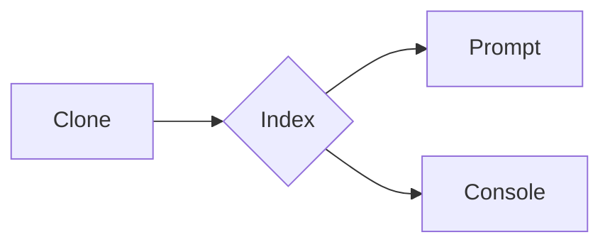

# Sobre o Projeto:

Sistema que solicita a quantidade de inputs e após a inserção dos dados ordena e calcula a media e mediana de temperaturas

### FLUXOGRAMA/DIAGRAMA

### COMO USAR:
<ul>
  
  <li>
    
<b><code>1º Digite no promt a quantidade de dados.</code></b>

  </li>
  
  <li>
    
<b><code>2º Abrir console no navegador.</code></b>

    
<i>Aperte o botão direito do mouse e clique em inspencionar e abra o menu console

  </li>
  
  <li>
    
<b><code>3º - Digite os dados nos inputs e clique em enviar</code></b>

  </li>
  
  
  
</ul>
