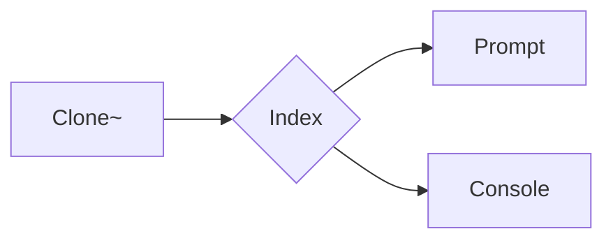

# Sobre o Projeto:

Sistema que solicita a quantidade de inputs e após a inserção dos dados calcula a media e mediana de temperaturas

### FLUXOGRAMA/DIAGRAMA

```mermaid
flowchart LR

C[Clone~] --> D{Index}
D --> E[Prompt]
D --> F[Console]

```

